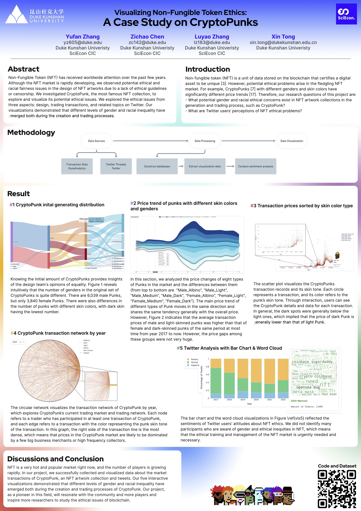

# Inequality in NFT: A Visual Exploration

Poster presented at ChinaVis 2022

[arXiv](https://doi.org/10.48550/arXiv.2206.12922) | [Live Demo](http://yufanbruce.com/cryptopunks/)

**Authors**: [Yufan Zhang](http://yufanbruce.com), Zichao Chen, Luyao Zhang, Xin Tong




## How to use

### Install dependencies

```bash
conda create -n nft python=3.7
conda activate nft
pip install -r requirements.txt
```

### Run Dash app

```bash
cd ./app
python app.py
``` 